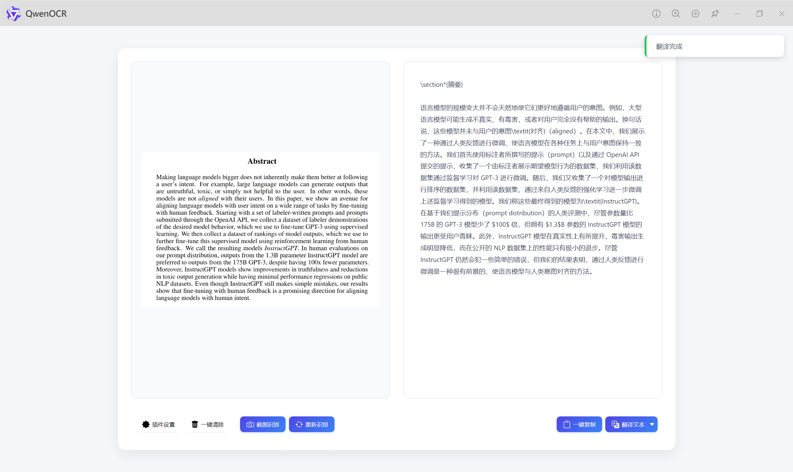
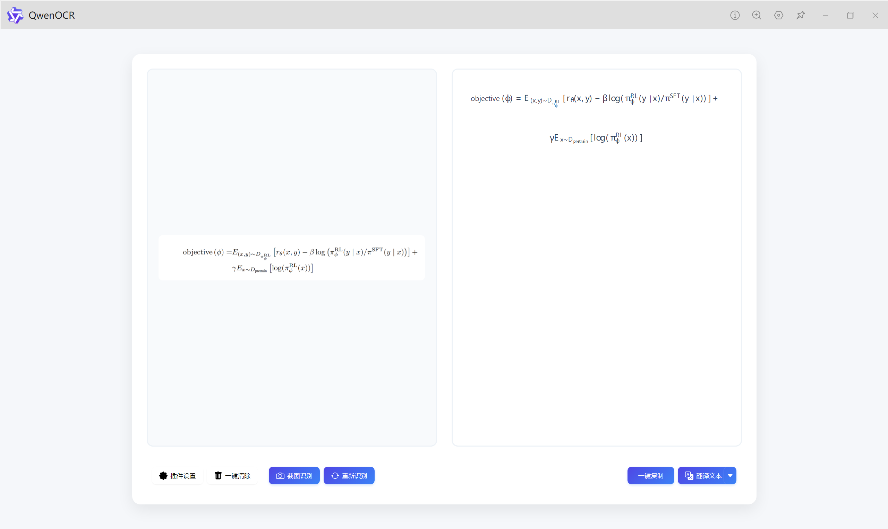
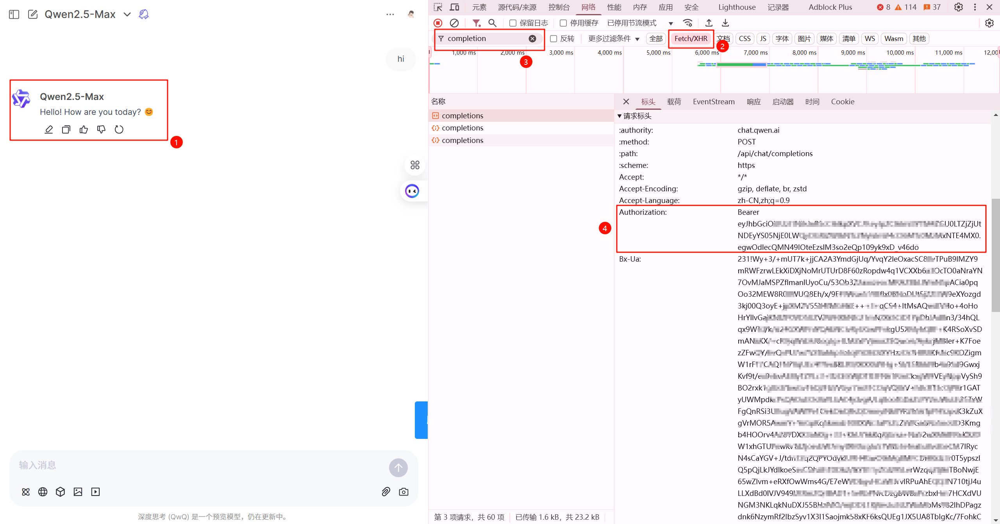

# 🔍 Qwen OCR - uTools 插件

> 🤖 基于通义千问大模型的智能 OCR 识别工具

## 项目展示

## ✨ 特性

- 🧠 自动获取支持视觉的通义千问模型
- 🔄 支持多个 API Token 轮换使用
- 🎯 精准的文字识别能力
- 📐 完美支持数学公式（自动转换为 LaTeX 格式）
- 💻 代码块智能识别（自动格式化为 Markdown 代码块）
- 📝 可自定义 Prompt
- 📋 一键复制识别结果
- 🔄 支持重新识别
- 🌐 支持多语言翻译功能（中文、英文、日语、韩语、法语、德语、西班牙语、俄语）
- 📜 支持自定义模板配置（目标检测等高级功能），充分利用通义千问的强大视觉能力

## 📥 安装方法
### 方法一：通过 uTools 安装
1. 下载插件安装包
2. 选中安装包，按下 Ctrl + C 复制
3. 再按下 Alt + 空格键呼出 uTools
4. 将安装包粘贴到搜索框中，选择"安装插件/应用"

### 方法二：通过 uTools 插件市场安装
1. 打开 uTools 插件市场
2. 搜索 "QwenOCR"
3. 点击"安装"按钮
4. 安装完成后，即可在 uTools 中使用

## 🚀 使用方法

1. ⌨️ 通过 uTools 关键字呼出插件：
   - `qwen`
   - `ocr`
   - `识别`
   - `截图文字识别`
   - `文字识别`
   - `图片文字识别`
2. 🔑 打开插件，点击"插件设置"配置通义千问 API Token
3. 选择以下任意方式输入图片：
   - 🖼️ 拖拽图片到识别区域
   - 📋 复制图片后直接粘贴
   - 📤 点击识别区域上传图片
   - 📸 点击"截图识别"进行屏幕截图
   - 📂 直接拖拽图片文件到 uTools 搜索框
4. 识别完成后，可以：
   - 📋 点击"一键复制"复制识别结果
   - 🔄 点击"重新识别"重新处理当前图片
   - 🌐 点击"翻译文本"将识别结果翻译为其他语言
   - 🗑️ 点击"一键清除"清空结果

## 🎨 功能展示

### 文本识别

### 识别结果翻译

### LaTeX 公式识别

### 代码识别

### 目标检测

## ⚙️ 配置说明

1. 获取通义千问 API Token：
   - 访问 [通义千问开放平台](https://chat.qwenlm.ai)
   - F12 打开控制台-应用，token 字段就是需要的 key

2. 配置插件：
   - 点击插件界面的"插件设置"
   - 填入 API Token（支持多个 Token，用英文逗号分隔）
   - 选择 OCR 识别模型（默认为 qwen2.5-vl-72b-instruct）
   - 可选：自定义识别 Prompt

3. 高级功能：
   - 自定义模板：可以创建和保存自定义 Prompt 模板
   - 多语言翻译：支持将识别结果翻译为多种语言，需配置 OpenAI 格式的 API Key

## 📝 注意事项

- 🌐 使用时需要确保网络连接正常
- 📊 建议使用清晰的图片以获得最佳识别效果
- 🔄 临时文件会在一小时后自动清理
- ⚠️ 公式识别效果依赖于图片质量和通义千问模型的能力

## 🤝 贡献

欢迎提交 Issue 和 Pull Request！

## 重要声明

本项目仅供学习和研究使用，任何商业用途或滥用行为均与作者无关。请遵守相关法律法规和平台的使用条款。本项目不会收集任何用户数据，所有数据直接与 API 交互。

## 📄 许可证

MIT License

## 🙏 鸣谢

- [通义千问开放平台](https://chat.qwenlm.ai)
- [uTools](https://u.tools)
- [ocr-based-qwen](https://github.com/Cunninger/ocr-based-qwen)
- [Qwen2API](https://github.com/Rfym21/Qwen2API)
- [uTools-qwen-ocr (UI 借鉴)](https://github.com/lol3721987/utools-qwen-ocr)